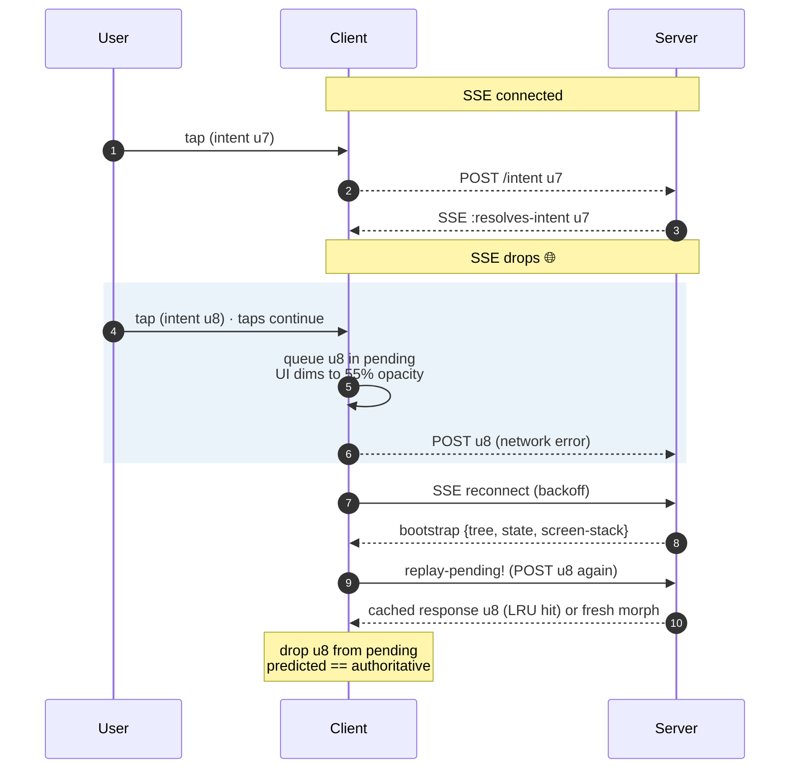

import { Aside } from '@astrojs/starlight/components';

## The contract

When the SSE stream drops, three things have to be true for the
user not to lose their work:

1. The UI keeps rendering (no blank screen).
2. Clicks during the outage are not lost.
3. After reconnect, the UI converges on the authoritative server
   state without weird middle states.

Wun handles all three.

## Reconnect at a glance



## (1) UI keeps rendering

The last `display-tree` stays bound to whatever each platform's
view layer is rendering. We never blank it on disconnect. CSS /
Modifier alpha drops the visual opacity to ~55% so the user
*knows* clicks are queued, but the tree itself is intact:

- Web: `<body class="wun-offline">` + `#app` dims via CSS.
- iOS: `.opacity(0.55)` on the WunView container.
- Android: `Modifier.alpha(...)` driven by the same status.

## (2) Clicks during outage

Clicks fire intents through the regular dispatcher. The POST goes
out; if the network is down, the fetch promise rejects. The
**pending** queue in `wun.web.intent-bus` keeps the entry
regardless — we don't drop it on POST failure.

When SSE reconnects:

```clojure
(bus/replay-pending!)
```

…re-POSTs every still-pending intent. Each carries its original
UUID. Server-side dedup (LRU 1024) returns the cached response for
any UUID it already processed (the disconnect happened *after* the
server saw the POST), or runs the morph fresh if not.

Either way, the resulting `:resolves-intent` envelope drops the
matching pending entry on the client. No double-apply. No lost
clicks.

## (3) Convergence

The bootstrap envelope sent on (re)connect contains:

- A `:replace` at root with the current authoritative tree.
- The current `:state`.
- The current `:screen-stack` and `:presentations`.

The client diffs against its prior tree (which still reflects the
pre-disconnect state), applies the patches, and the optimistic
predictions are layered on top via the pending queue. After the
last replay-pending POST is resolved, the predicted state matches
the authoritative state.

If the predicted state diverged (the user's optimistic morph
disagreed with the server's), the next confirmed envelope ships
patches that correct it. Brief flicker, then settled — the
LiveView "stale ok" idiom.

## Backoff

Native clients reconnect with exponential backoff:

```
1s, 2s, 4s, 8s, 16s, 30s (cap)
```

Plus 0–500ms jitter so a thundering herd doesn't reconnect in
lockstep. The browser's `EventSource` does its own retry; we layer
no extra logic on top.

## TTL

Pending intents older than 30s are dropped. If a reconnect takes
longer than that, the user has effectively lost those clicks — but
30s is long enough that no normal disconnect drops anything, and
short enough that a forgotten tab on a sleeping laptop doesn't
permanently shadow the queue.

<Aside type="caution" title="Watch for SSE buffering">
  Some HTTP/2 proxies (notably older nginx and ALBs) buffer SSE
  responses, delaying patches by seconds and making spurious
  reconnects look like a server bug. If you see steady-state
  delays of >1s under load, check `proxy_buffering off;` and
  `X-Accel-Buffering: no` first.
</Aside>
