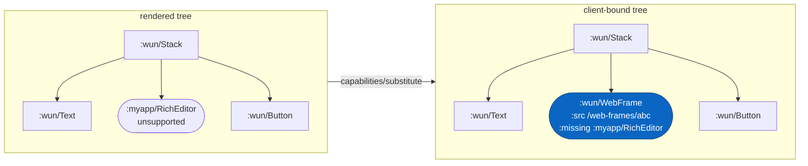

> **TL;DR.** Native clients advertise the components they can
> render at connect time. The server walks the rendered tree and
> replaces anything the client doesn't know with a `:wun/WebFrame`
> at the **smallest containing subtree**. New components ship
> without breaking older clients.

Different clients render different subsets of the component
vocabulary. Web might not have `:myapp/RichEditor`. iOS might lag
the latest `:wun/Switch` schema. The server has to know each
client's capability set so it can collapse unsupported subtrees to
a `:wun/WebFrame` fallback **at the smallest containing level**.

## How clients advertise

Native clients send a header on SSE connect:

```
X-Wun-Capabilities: wun/Stack@1,wun/Text@1,wun/Button@1,...
X-Wun-Format:       json
```

Web sends the same payload as a query param (EventSource can't set
custom headers):

```
GET /wun?caps=wun%2FStack%401%2C... HTTP/1.1
```

Each entry is `<keyword>@<version>`. Version is the client's
`:since` for that component.

## How collapse works



Substitution stops at the smallest containing subtree, so children
inside an unsupported component never need to be checked individually.

## How the server uses it

For each broadcast, the server runs `wun.capabilities/substitute`
over the rendered tree:

1. Walk the tree looking for component keywords.
2. If the client advertises this component at a version `>=` the
   server's `:since`, render it natively.
3. Otherwise, replace it with `[:wun/WebFrame {:src ... :missing :ns/Name}]`
   at this position, **and stop walking the subtree** — children
   inside an unsupported component never need to be substituted
   individually.

The result: a tree where every native component is renderable,
every gap is a single self-contained WebFrame, and the wire stays
identical in shape.

## What the WebFrame renderer does

`:wun/WebFrame` is a foundational component every client must
implement. The native renderer opens the `:src` URL in a WebView
(WKWebView on iOS, WebView on Android) and shows whatever HTML the
server returns.

The server's `/web-frames/<key>/<token>` endpoint:

- Looks up the original subtree by content-addressed token.
- Renders it to HTML via `wun.server.html`.
- Returns a complete document with the foundational stylesheet plus
  the WunBridge script (so click handlers inside the frame fire
  intents through the host's native dispatcher, not via a fresh
  fetch).

## Per-component coverage

`wun status` shows which platforms have native renderers for each
declared component:

```
component               web  ios  android  server-html
:wun/Stack               ✓    ✓    ✓        ✓
:wun/Avatar              ◌    ✓    ✓        ✓
:myapp/Greeting          ◌    ✓    ✓        ·
```

`✓` native renderer present. `◌` WebFrame fallback. `·` server
default HTML (the component is declared but has no custom HTML
mapping, so it renders via the default `wun-unknown` block).

## Versioning components

Bump `:since` whenever the schema changes incompatibly:

```clojure
(defcomponent :myapp/Card
  {:since 2                       ;; bumped from 1
   :schema [:map [:title :string]
                 [:subtitle :string]]   ;; new required prop
   ...})
```

Old clients that advertise `:myapp/Card@1` see a WebFrame fallback;
new clients that advertise `:myapp/Card@2` render natively. Once
all clients are updated you can drop the old version's fallback
behaviour, but the protocol-level capability check is the only
place that needs to know.

## Read next

- [Component vocabulary](/reference/components/) — every `:wun/*`
  the framework ships, with `:since` versions.
- [Components](/concepts/components/) — declaring components and
  registering renderers.
- [Wire format](/concepts/wire-format/) — what goes over the SSE
  channel after substitution.
