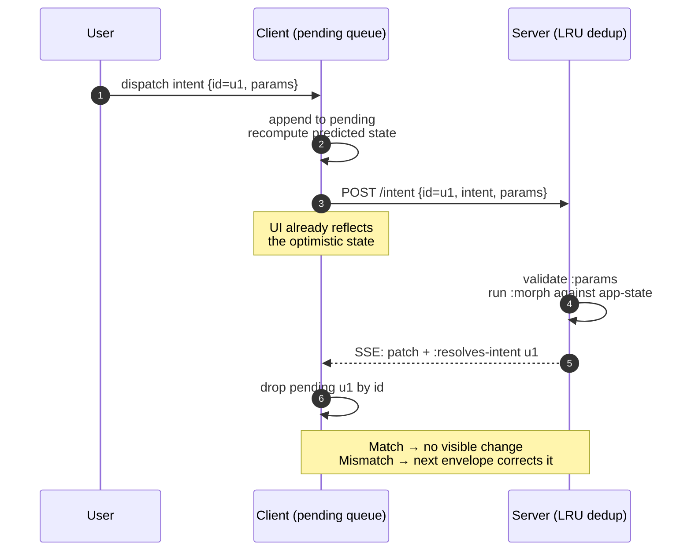

> **TL;DR.** An intent is a UUID-tagged action. Its `:morph` is a
> pure `(state, params) → state` fn that runs on **both** server
> (authoritative) and client (optimistic). The UI updates the moment
> the user clicks; the server's confirmation envelope just resolves
> the pending entry.

An intent is a discrete state mutation: "increment counter",
"mark todo done", "log out". Wun's wire model is built around them:
intents flow client → server, the server applies a pure morph,
clients reconcile via UUID.

## definent

```clojure
(definent :counter/inc
  {:params [:map]
   :morph  (fn [state _params]
             (update state :counter (fnil inc 0)))})

(definent :counter/by
  {:params [:map [:n :int]]
   :morph  (fn [state {:keys [n]}]
             (update state :counter (fnil + 0) n))})
```

| key       | meaning                                                              |
|-----------|----------------------------------------------------------------------|
| `:params` | Malli schema validated on **both** sides of the wire.                |
| `:morph`  | Pure `(state, params) → state`. Runs identically on server + client. |

## How an intent flows



## The two execution sites

### Server (authoritative)

POST `/intent` lands. The server validates params, runs `:morph`
against `app-state`, stores the result. If validation fails it
returns 400 with the Malli explanation. If it succeeds it
broadcasts the resulting tree change to every open SSE connection.

### Client (optimistic)

The client appends the intent to a `pending` queue and recomputes
its predicted state via `(reduce morph confirmed-state pending)`.
The display tree re-renders immediately. The POST goes out in
parallel; when the server's confirmation envelope arrives tagged
with the intent UUID, the matching pending entry drops.

Match → no visible change. Mismatch → the UI converges on the new
authoritative state on the next confirmed envelope.

## Server-side dedup

Each intent carries an `:id` (UUID). The server keeps a bounded
LRU (1024 entries) of recently-seen ids → cached responses.
Duplicate POSTs (the client retried after a flaky network) return
the cached response without re-running the morph or re-broadcasting.

This makes client-side retry **safe**: the web client replays still-
pending intents whenever the SSE stream reconnects. Anything the
server already processed is idempotent.

## Framework intents

The framework reserves a handful of intent keywords for built-in
operations. They're registered through the same `definent` API as
your code; user intents and framework intents are indistinguishable
to the runtime.

### Navigation

| intent           | does                                                              |
|------------------|-------------------------------------------------------------------|
| `:wun/navigate`  | Push a screen onto the connection's stack. Params: `{:path …}` or `{:screen :ns/name}`. |
| `:wun/pop`       | Pop the top of the connection's stack.                            |
| `:wun/replace`   | Replace the top of stack. Same params shape as `:wun/navigate`.   |

Navigation intents bypass the morph registry — they mutate
per-connection state (the screen-stack) instead of an app-state slice.

### Forms

| intent              | does                                                              |
|---------------------|-------------------------------------------------------------------|
| `:wun.forms/change` | Set a field's value, mark it touched, clear its error.            |
| `:wun.forms/touch`  | Mark a field touched (typically on blur).                         |
| `:wun.forms/reset`  | Reset a form to its empty state.                                  |
| `:wun.forms/submit` | Validate, run handler, merge outcome. Params: `{:form :form-id}`. |

`:wun/Field` wires `change` + `touch` automatically; `:wun/Form`'s
`<form>` element fires `submit` on Enter / button-click. See
[Forms & uploads](/concepts/forms/) for the full shape.

## Rules

- **Morph is pure.** Same `(state, params)` always produces the
  same new state. Side effects belong in `:fetch` (server-only) or
  outside intents entirely.
- **Schema everything.** Even `:map` (any map, optional everything)
  is better than no schema — it documents what the intent expects
  and protects both wire boundaries.
- **One intent, one transition.** Don't bundle unrelated state
  changes; downstream tooling (replay, undo, history) gets richer
  the smaller each intent is.

## Common mistakes

- **Side effects in the morph.** It runs twice (server +
  optimistic). Side effects double-fire. Move them out.
- **Returning a different shape.** Keep state shape stable; new
  fields are fine, removing existing fields needs a migration.
- **Forgetting the param schema.** A missing schema means any
  payload is accepted; debugging optimistic divergence gets nasty.

## Read next

- [Wire format](/concepts/wire-format/) — the intent envelope and
  the patch envelope it triggers.
- [Reconnect & retry](/architecture/reconnect/) — how pending
  intents survive an SSE drop and replay safely.
- [Server-driven UI](/concepts/sdui/) — the full request loop.
