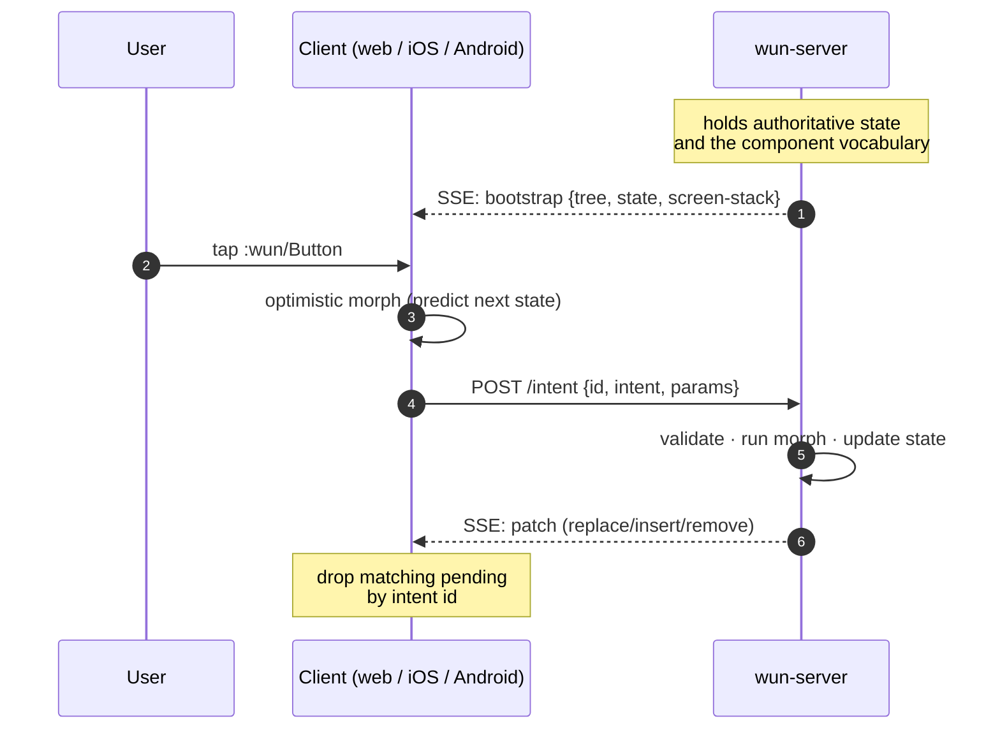

import { Aside } from '@astrojs/starlight/components';

> **TL;DR.** The server runs the UI loop. It owns state, the
> component vocabulary, and every intent's morph. Clients mirror
> the rendered tree, render it natively, and dispatch user actions
> back as data — never closures, never callbacks.

In Wun, the **server is the source of truth** for application state.
Clients are thin: they receive a tree of UI structure, render it
natively, and dispatch user actions back as data-shaped intents.

## The loop

One SSE channel per client. The server keeps a per-connection
"prior tree" and emits patches (`:replace` / `:insert` / `:remove`)
that mutate the client's mirror. Intents POST to `/intent`, the
server applies a pure morph to its state, then broadcasts the
resulting tree change to every open SSE connection.

## What the server owns

- The authoritative app state.
- The component vocabulary (`defcomponent`).
- The screens (`defscreen`) — paths, render fns, page metadata,
  presentation hints.
- The intents (`defintent`) — schemas and morphs.
- All persistence + side effects.

## What the client owns

- The native rendering surface — SwiftUI views, Compose nodes, DOM.
- A local mirror of the server's tree (replayable).
- A pending-intent queue for optimistic prediction.
- Meta application — `document.title`, NavigationView title, etc.
- Hot-cache snapshots for cold-start hydration.

Clients **do not** own state. There's no Redux / Pinia / Bloc here.
Local-only state (form drafts, scroll position, ephemeral focus)
lives in platform-idiomatic wrappers around the rendered tree, never
in the wire.

## The optimistic side

The same `:morph` fn from `defintent` runs on **both** server (when
an intent POST lands) and client (when the user dispatches). The
client computes a predicted state immediately, re-renders, and POSTs
in parallel. When the server's confirmation envelope arrives tagged
with the intent's UUID, the client drops the matching pending entry.

Match → no visible change. Mismatch → the UI converges on the
authoritative server tree on the next confirmed envelope.

<Aside type="tip" title="Pure morphs only">
  The same `:morph` runs twice (server + client). Side effects
  double-fire. Keep the morph pure; do `:fetch` on the server, dispatch
  follow-up intents from the result. See [Intents](/concepts/intents/) for
  the full pattern.
</Aside>

## Why this works

- **One vocabulary.** `:wun/Button` and `:myapp/Card` are
  indistinguishable to the runtime. New components ship via
  user-namespaced packs, not framework releases.
- **Wire-level diffing.** Patches are tiny and composable. No
  full-page re-renders.
- **Capability negotiation.** Clients tell the server what they can
  render; the server collapses unsupported subtrees to
  `[:wun/WebFrame ...]` at the smallest containing level.
- **No build step on the server**. Edit cljc, save, the server
  hot-reloads (Clojure's REPL story is built-in). Native clients
  get the new tree without rebuilding.

## Reference

- [Components](/concepts/components/)
- [Screens](/concepts/screens/)
- [Intents](/concepts/intents/)
- [Wire format](/concepts/wire-format/)
