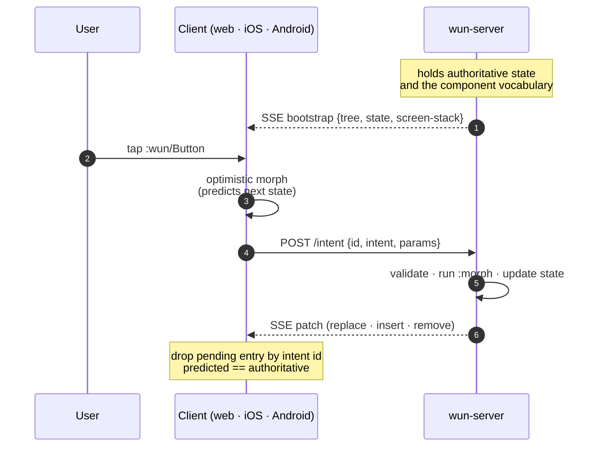

import { Aside, Tabs, TabItem, Steps, Code } from '@astrojs/starlight/components';
import PlatformStrip from '../../components/PlatformStrip.astro';
import Feature       from '../../components/Feature.astro';
import Compare       from '../../components/Compare.astro';
import { withBase }  from '~/utils/base.mjs';

<div class="wun-eyebrow">
  <span class="wun-eyebrow__dot" aria-hidden="true"></span>
  Clojure-first &middot; SDUI for the post-LiveView era &middot; v0.1 spike
</div>

## The same screen, every platform

<div class="wun-grid-bg">
  <PlatformStrip />
</div>

The server holds state. Patches stream over a single SSE channel.
Every client renders **natively** from the same tree. Tap a button,
the intent flies back, the server morphs state, and every connected
client sees the new tree on the next patch.

<Aside type="tip" title="Read this in 60 seconds">
**Wun moves the UI loop to the server**. You write three macros —
`defcomponent` (a UI primitive), `defscreen` (a route), `definent`
(a state mutation) — once, in `.cljc`. The server renders to a tree
of namespaced keywords; web/iOS/Android each bind those keywords to
their native widget. Anything a client can't render falls back to a
sandboxed WebView frame at the smallest containing subtree.
</Aside>

## The whole authoring surface fits in one screen

Three macros — `defcomponent`, `defscreen`, `definent`. Framework
primitives use the exact same APIs as your application code. There
is no privileged path.

<Tabs syncKey="macro">
  <TabItem label="defscreen">

```clojure
;; A screen is a path + a render fn over state.
;; Page metadata (:title, :theme-color) rides on every patch envelope
;; so :title becomes <title> on web, .navigationTitle on iOS, and
;; the Compose Window title on Android — automatically.
(defscreen :counter/main
  {:path    "/"
   :present :push                                ; :push or :modal
   :meta    (fn [s] {:title (str "Counter " (:n s 0))})
   :render  (fn [s]
             [:wun/Stack {:gap 12 :padding 24}
              [:wun/Heading {:level 1} "Counter"]
              [:wun/Text {:variant :h2} (str (:n s 0))]
              [:wun/Stack {:direction :row :gap 8}
               [:wun/Button {:on-press {:intent :counter/dec}} "−"]
               [:wun/Button {:on-press {:intent :counter/inc}} "+"]]])})
```

  </TabItem>
  <TabItem label="definent">

```clojure
;; An intent is a Malli-typed action with a *pure* morph.
;; Same fn runs server-side (authoritative) and client-side
;; (optimistic prediction). Reconcile via UUID.
(definent :counter/inc
  {:params [:map]
   :morph  (fn [state _]
             (update state :n (fnil inc 0)))})

(definent :counter/by
  {:params [:map [:n :int]]
   :morph  (fn [state {:keys [n]}]
             (update state :n (fnil + 0) n))})
```

  </TabItem>
  <TabItem label="defcomponent">

```clojure
;; A component is a namespaced keyword + per-platform renderers.
;; Schema is Malli; capability negotiation reads :since to decide
;; native-vs-WebFrame fallback for older clients.
(defcomponent :myapp/Card
  {:since    1
   :schema   [:map [:title {:optional true} :string]]
   :loading  :inherit
   :fallback :web
   :ios      "Card"
   :android  "Card"})
```

  </TabItem>
</Tabs>

<div class="wun-cta-row">
  <a class="wun-cta-card" href={withBase('/getting-started/install/')}>
    <strong>Install in 60 seconds →</strong>
    <span>Babashka installer, then <code>wun new app myapp</code>.</span>
  </a>
  <a class="wun-cta-card" href={withBase('/concepts/sdui/')}>
    <strong>How it works →</strong>
    <span>The full server-driven UI loop, end to end.</span>
  </a>
</div>

## What you get

<div class="wun-features">
  <Feature title="Three macros, total" href="/concepts/components/" icon="tile">
    `defcomponent`, `defscreen`, `definent` are the entire authoring
    surface. Framework primitives use the same APIs as your code —
    `:wun/Stack` and `:myapp/Card` are indistinguishable to the runtime.
  </Feature>
  <Feature title="One wire format" href="/concepts/wire-format/" icon="wire">
    A Hiccup-shaped tree with namespaced keywords, sent as transit
    or JSON envelopes. Same shape lands on the web, in SwiftUI, and
    in Compose. No platform-specific schema to drift.
  </Feature>
  <Feature title="Optimistic by default" href="/concepts/intents/" icon="bolt">
    The same pure `:morph` runs server-side (authoritative) and
    client-side (predictive). UI updates the moment the user clicks;
    the round-trip just confirms.
  </Feature>
  <Feature title="Forward-compatible fallback" href="/concepts/capabilities/" icon="shield">
    Any component the native client lacks collapses to a sandboxed
    `:wun/WebFrame` at the smallest containing subtree. New components
    ship without breaking older clients.
  </Feature>
  <Feature title="Reconnect that doesn't lose work" href="/architecture/reconnect/" icon="cycle">
    The last tree stays rendered while the SSE stream is down. Clicks
    queue locally, replay on reconnect, and dedup against an LRU on
    the server so retries never double-apply.
  </Feature>
  <Feature title="One CLI for the whole monorepo" href="/reference/cli/" icon="cli">
    `wun new app`, `wun add component`, `wun dev`, `wun status`. The
    scaffolders splice idempotently across cljc, Swift, and Kotlin so
    you never edit five places by hand.
  </Feature>
</div>

## How a tap travels



The full architecture write-up — head metadata, hot-cache hydration,
reconnect semantics — lives under <a href={withBase('/architecture/head-and-cache/')}>Architecture</a>.

## Where Wun fits

<Compare />

The bet: keep UI **state** on the server, ship **structure** to
clients as data, let each platform render that structure natively.
The result feels native because it *is* native — but no platform
duplicates UI logic.

## Quick start

<Steps>

1. **Install the CLI.**

   ```bash
   git clone https://github.com/Holy-Coders/wun.git
   cd wun && ./install.sh
   wun doctor
   ```

2. **Scaffold an app.**

   ```bash
   wun new app myapp
   cd myapp
   npm install
   ```

3. **Run all four surfaces in parallel.**

   ```bash
   wun dev               # server :8080 + shadow-cljs watch :8081
   wun run ios           # macOS demo via swift run (separate term)
   wun run android       # Compose Desktop via gradle run
   ```

   Open <code>http://localhost:8081</code>, an iOS simulator, and a
   Compose window. Tap `+` in any of them — the other surfaces update
   on the next patch.

</Steps>

The full walkthrough lives at <a href={withBase('/getting-started/your-first-app/')}>Your first app</a>.

## Built for AI agents too

Wun ships first-class agent surfaces. Drop into any new app and a
coding agent — Claude Code, Cursor, Cline, Continue — orients in
seconds:

- **`CLAUDE.md` / `AGENTS.md`** at repo root — project orientation,
  the three macros, common gotchas.
- **`skills/`** — short, narrow how-to playbooks for canonical Wun
  tasks (wire an intent, add a screen with a form, ship a breaking
  change).
- **`mcp/server.mjs`** — a Model Context Protocol server exposing
  `wun status`, `wun add component`, and the doc resources to any
  MCP-aware client.

See <a href={withBase('/ai/agents/')}>AI integration</a> for the
full surface.

## Inspired by

[Phoenix LiveView](https://hexdocs.pm/phoenix_live_view) for the
stateful-socket model and head merging; [Hotwire
Turbo](https://turbo.hotwired.dev) and [Hotwire
Native](https://native.hotwired.dev) for the WebFrame fallback
posture; the broader [server-driven UI](https://martinfowler.com/articles/server-driven-ui.html)
movement for the "structure, not pixels" wire model. The Clojure
side leans on [Malli](https://github.com/metosin/malli) for schemas
and the standard data-as-API + macro patterns to keep the framework
surface tight.

## Status

The framework is a working spike — see the
[changelog](https://github.com/Holy-Coders/wun/commits/master) on
GitHub for what's landed, and
[issues](https://github.com/Holy-Coders/wun/issues) for what's next.
Browse the docs sidebar for the concepts and the CLI reference.
